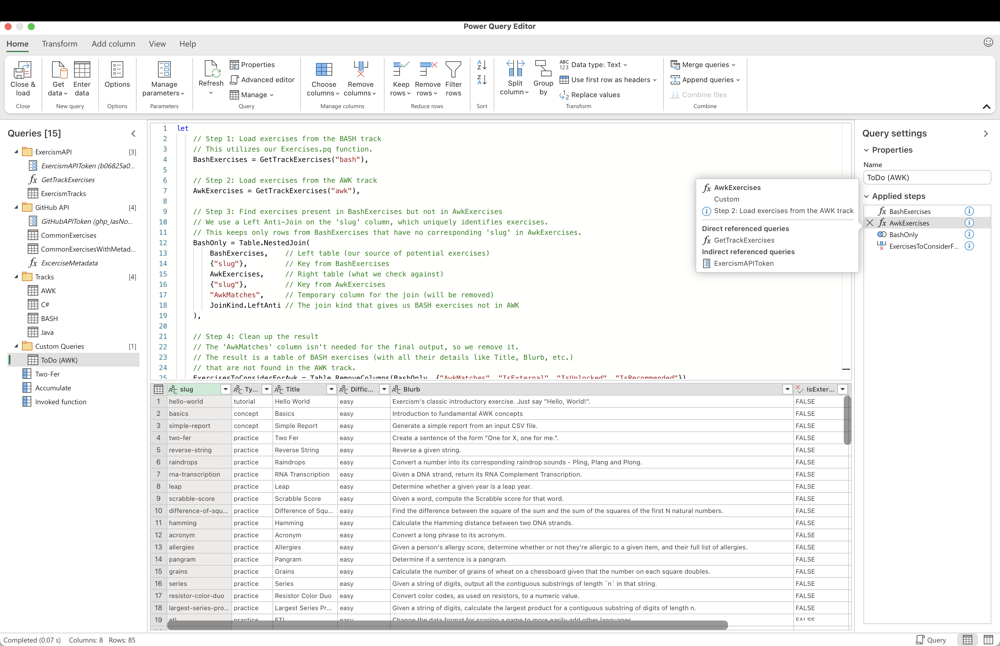
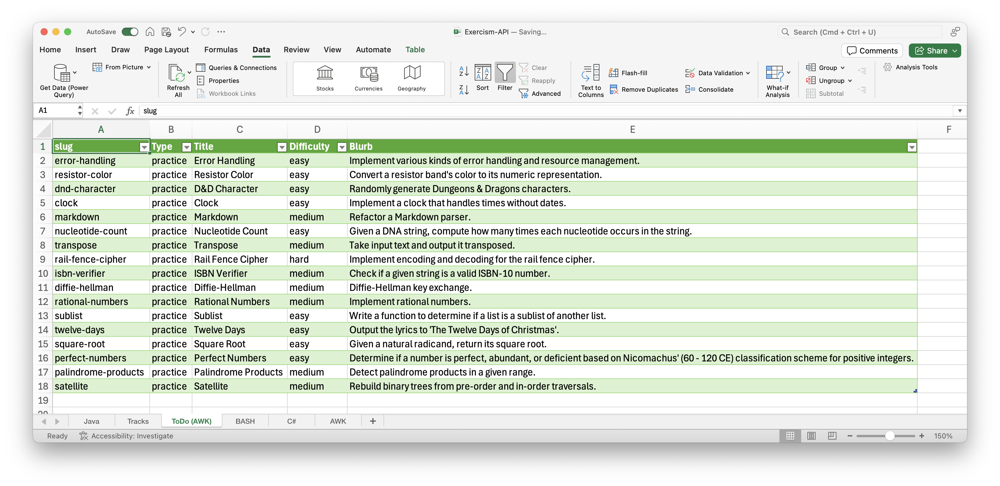

# Identifying BASH Exercises Missing from AWK

As the maintainer of the AWK track on Exercism, I often look to the BASH track for exercises that can be ported.
Many BASH exercises have tests and concepts that are highly adaptable to AWK.
This guide outlines how to use our `GetTrackExercises` Power Query function to get a clear list of BASH exercises that aren't yet in the AWK track.

## Setup

Ensure the `GetTrackExercises` function is loaded in your Power Query environment. You can find its definition in this repository at:
[`powerquery/GetTrackExercises.pq`](src/exercism-api/GetTrackExercises.pq)

## The Query

Here’s the M code. You can drop this into the Advanced Editor of a new blank query.

```powerquery
let
    // Step 1: Load exercises from the BASH track
    // This utilizes our GetTrackExercises.pq function.
    BashExercises = GetTrackExercises("bash"),

    // Step 2: Load exercises from the AWK track
    AwkExercises = GetTrackExercises("awk"),

    // Step 3: Find exercises present in BashExercises but not in AwkExercises
    // We use a Left Anti-Join on the 'slug' column, which uniquely identifies exercises.
    // This keeps only rows from BashExercises that have no corresponding 'slug' in AwkExercises.
    BashOnly = Table.NestedJoin(
        BashExercises,    // Left table (our source of potential exercises)
        {"slug"},         // Key from BashExercises
        AwkExercises,     // Right table (what we check against)
        {"slug"},         // Key from AwkExercises
        "AwkMatches",     // Temporary column for the join (will be removed)
        JoinKind.LeftAnti // The join kind that gives us BASH exercises not in AWK
    ),

    // Step 4: Clean up the result for a focused list
    // The 'AwkMatches' column (an artifact of the join) is removed.
    // Additional boolean flag columns ('IsExternal', 'IsUnlocked', 'IsRecommended') are also removed
    // to streamline the table to the most relevant details for porting consideration (like Slug, Title, Blurb, Type, Difficulty).
    ExercisesToConsiderForAwk = Table.RemoveColumns(BashOnly, {"AwkMatches", "IsExternal", "IsUnlocked", "IsRecommended"})
in
    ExercisesToConsiderForAwk
```



## How to Use

1.  In Power Query (Excel, Power BI, etc.), create a new blank query.
2.  Open the **Advanced Editor**.
3.  Paste the M script above.
4.  Click **Done**.

The query will then output a table.



## Application for AWK Track Maintenance

The resulting table lists all exercises (with their details like `slug`, `Type`, `Title`, `Difficulty`, `Blurb`) that are part of the BASH track but are currently missing from the AWK track.

This list is invaluable for:
* **Identifying candidates for porting**: You get a clear "to-do" or "consideration" list.
* **Streamlining the porting process**: Instead of manually comparing tracks, this query automates the discovery step.
* **Aligning with BASH track**: Helps in deciding which exercises make sense to adapt, especially when following existing guidelines for porting from BASH.


