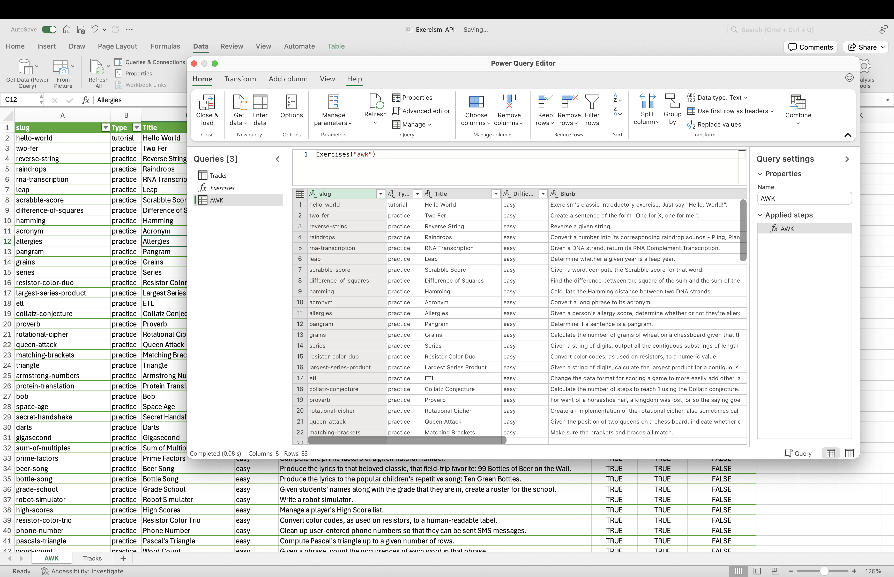

# Power Query M for Exercism API

Welcome! This repository provides Power Query M scripts to easily fetch data directly from the [Exercism.org API](https://exercism.org/docs/api/v2). This allows you to pull information about language tracks and their exercises into environments like Excel or Power BI for analysis, reporting, or track maintenance.

## Overview

This collection currently focuses on the following core scripts:

1.  **`ExercismAPIToken.pq`**: A parameter query to securely store your Exercism API token.
2.  **`ExercismTracks.pq`**: A query that retrieves a comprehensive list of all language tracks available on Exercism.
3.  **`GetTrackExercises.pq`**: A function that fetches all exercises for a specified language track.

These scripts are designed to be robust, including basic error handling for API connectivity and JSON parsing. Both `ExercismTracks.pq` and `GetTrackExercises.pq` can optionally use the `ExercismAPIToken` for authenticated API requests.

## Available Scripts

### 1. `ExercismAPIToken.pq` (Parameter)

* **File:** [`powerquery/ExercismAPIToken.pq`](powerquery/ExercismAPIToken.pq)
* **Type:** Parameter Query
* **Description:** Defines a Power Query parameter to securely store your personal Exercism API token. This allows other queries to make authenticated requests to the Exercism API.
* **How to Obtain Your Token:**
  1.  Log in to [Exercism.org](https://exercism.org).
  2.  Click the three-dot menu (top right) -> "Settings".
  3.  Select "API / CLI Token" and copy your token.
* **Usage:**
  1.  Import `ExercismAPIToken.pq` into Power Query (see Setup).
  2.  Rename the imported query to `ExercismAPIToken`.
  3.  Edit the query and replace the placeholder `"put your Exercism API Token here"` with your actual token.

### 2. `ExercismTracks.pq` (Query)

* **File:** [`powerquery/ExercismTracks.pq`](powerquery/ExercismTracks.pq)
* **Type:** Query (Self-executing when loaded)
* **Description:** Fetches a list of all language tracks from the Exercism API. If the `ExercismAPIToken` parameter is set, it will be used for authentication.
* **Output Columns:**
  * `slug` (text): The unique identifier for the track (e.g., "csharp", "awk").
  * `Title` (text): The display name of the track.
  * `HasCourse` (logical): `true` if the track is structured as a course.
  * `ConceptsCount` (Int64.Type): The number of concepts in the track.
  * `ExercisesCount` (Int64.Type): The number of exercises in the track.
  * `WebURL` (text): The direct URL to the track page.
  * `TagsList` (text): A comma-separated string of tags.
* **Usage:**
  1.  Optionally, set up the `ExercismAPIToken` parameter first.
  2.  Import `ExercismTracks.pq` into Power Query.
  3.  Rename the query to `ExercismTracks`. It will execute automatically.

### 3. `GetTrackExercises.pq` (Function)

* **File:** [`powerquery/GetTrackExercises.pq`](powerquery/GetTrackExercises.pq)
* **Type:** Function
* **Description:** Fetches a list of exercises for a *specific* language track. If the `ExercismAPIToken` parameter is set, it will be used for authentication, which can provide user-specific data for fields like `IsUnlocked` and `IsRecommended`.
* **Parameter:**
  * `trackName` (text): The slug of the track (e.g., `"bash"`, `"awk"`).
* **Output Columns:**
  * `slug` (text): The exercise's unique identifier.
  * `Type` (text): The type of exercise.
  * `Title` (text): The exercise's title.
  * `Difficulty` (text): The exercise's difficulty level.
  * `Blurb` (text): A short description.
  * `IsExternal` (logical): If the exercise is external.
  * `IsUnlocked` (logical): If the exercise is unlocked (reflects user state if authenticated).
  * `IsRecommended` (logical): If the exercise is recommended (reflects user state if authenticated).
* **Usage:**
  1.  Optionally, set up the `ExercismAPIToken` parameter.
  2.  Import `GetTrackExercises.pq` and rename the query to `GetTrackExercises`.
  3.  In a new query, invoke the function: `GetTrackExercises("your-track-slug")`.

  

## Prerequisites

* A Power Query compatible environment:
  * Microsoft Excel (Windows or Mac)
  * Power BI Desktop
  * Power Query Online (Dataflows)
* Internet connectivity to reach the Exercism API (`https://exercism.org`).

## Setup & Installation

1.  **Download:** Clone this repository or download the individual `.pq` files from the [`powerquery/`](powerquery/) directory.
2.  **Import into Power Query:**
  * Open your Power Query Editor.
    * **Excel**: `Data` tab -> `Get Data` -> `Launch Power Query Editor...`.
    * **Power BI Desktop**: `Home` tab -> `Transform data`.
  * In the Power Query Editor, create a new query:
    * Right-click in the Queries pane -> `New Query` -> `Other Sources` -> `Blank Query`.
  * With the new blank query selected, click `Advanced Editor` on the `Home` tab.
  * Open the downloaded `.pq` file (e.g., `ExercismAPIToken.pq`) in a text editor.
  * Copy the entire M code from the `.pq` file.
  * Paste it into the Advanced Editor, replacing any existing content.
  * Click `Done`.
  * **Rename the query** to match the intended name (e.g., "ExercismAPIToken", "ExercismTracks", "GetTrackExercises"). This is crucial for them to work together correctly.

Repeat the import process for each `.pq` file. It's recommended to set up `ExercismAPIToken.pq` first if you plan to use authenticated requests.

## Advanced Usage Example

For a practical example of how to use the `GetTrackExercises` function to compare tracks (e.g., finding BASH exercises not yet in AWK), see:
[`HOW_TO_USE.md`](HOW_TO_USE.md)
*(This guide primarily uses `GetTrackExercises.pq`)*

## Notes & Troubleshooting

* **Authenticated vs. Anonymous Requests:** If `ExercismAPIToken` is not set up or empty, API calls will be anonymous. This might affect the data returned for user-specific fields like `IsUnlocked` or `IsRecommended` in the `GetTrackExercises` function.
* **API Rate Limits:** Be mindful of potential API rate limits. Using an API token might provide higher limits.
* **API Changes:** The data returned depends on the Exercism API (v2). Future API changes might require script updates.
* **Error Handling:** The scripts include basic error handling. Check your internet and API status if issues persist.

## Contributing

Contributions, issues, and feature requests are welcome!
* Open an issue to report a bug or suggest an improvement.
* Fork the repository and submit a pull request.

## License

This project is licensed under the **MIT License**. See the [LICENSE](LICENSE) file for details.
