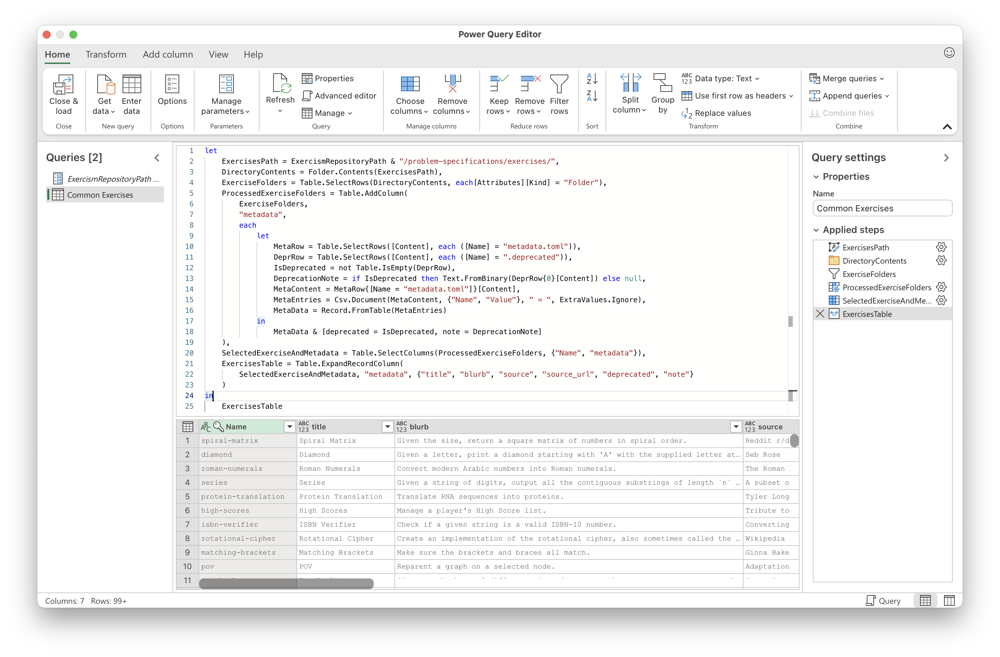
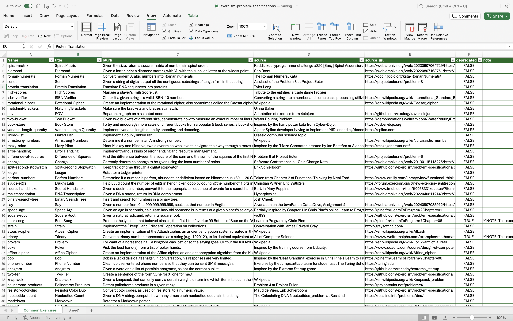

# Power Query Extractor for Exercism Exercise Data

## Overview

This Power Query solution provides tools to extract and view metadata for exercises from local clones of Exercism repositories. It's designed for Exercism maintainers and contributors to analyze this data in Microsoft Excel or Power BI.

The solution offers two main extraction capabilities:
1.  **Common (Canonical) Exercises (`fxCommonExercises`):** Extracts metadata, including deprecation status, for all canonical exercises from the `problem-specifications` repository.
2.  **Track-Specific Practice Exercises (`fxPracticeExercises`):** Retrieves a detailed list of practice exercises (including slugs, UUIDs, difficulty, and status) for a specific language track by reading its `config.json` file.

## Prerequisites

* Microsoft Excel (2016 or later / Microsoft 365 subscription) or Power BI Desktop.
* Local Git clones of the relevant Exercism repositories:
  * **`exercism/problem-specifications`**: Required for `fxCommonExercises`.
    * If you don't have it: `git clone https://github.com/exercism/problem-specifications.git`
  * **Individual Language Track Repositories (or the `exercism/v3` monorepo containing tracks)**: Required for `fxPracticeExercises`. These repositories contain the `config.json` files for each track.
    * Example: `git clone https://github.com/exercism/javascript.git` for the JavaScript track.
* The Power Query script files (or the Excel/Power BI file containing them).

## Setup Instructions

### Key Parameters

This solution relies on parameters you need to configure in Power Query.

1.  **`ExercismRepositoryPath` (Text Parameter)**
  * **Purpose:** This is the primary base path from which the scripts will locate repositories. It should point to a directory where you have cloned the necessary Exercism repositories.
  * **Expected Structure:**
    * For `fxCommonExercises`: The script expects to find the `problem-specifications` folder directly inside a folder constructed from this path (e.g., `YourChosenPath/problem-specifications/`). So, `ExercismRepositoryPath` should be set to `YourChosenPath`.
    * For `fxPracticeExercises`: The script expects to find individual track folders (e.g., `javascript`, `python`) directly inside this `ExercismRepositoryPath`. For example, `ExercismRepositoryPath/javascript/config.json`.
  * **Example:** If you have the following structure:
      ```
      /Users/username/exercism-dev/
          problem-specifications/  <-- For common exercises
          javascript/              <-- For JS practice exercises (contains config.json)
          python/                  <-- For Python practice exercises (contains config.json)
          ...
      ```
    Then, `ExercismRepositoryPath` should be set to: `"/Users/username/exercism-dev/"`
  * **Important:**
    * You **MUST** update the default placeholder value.
    * Use `/` (forward slashes) as the path separator. Power Query handles this correctly on all platforms.
    * The path must be **absolute**.

2.  **`TrackSlugParameter` (Text Parameter - for `fxPracticeExercises`)**
  * **Purpose:** Specifies the language track identifier (slug) for which you want to retrieve practice exercise data using `fxPracticeExercises`.
  * **Example Values:** `"javascript"`, `"python"`, `"csharp"`
  * You will need to set or change this parameter to switch between different language tracks for the `fxPracticeExercises` output.



## Running the Queries & Viewing Results

Once the parameters are correctly set:

1.  **`fxCommonExercises` Query:**
  * This query (or a query that uses it) will load the data for canonical exercises.
  * The output is described below under "Expected Output for `fxCommonExercises`".

2.  **`fxPracticeExercises` Query:**
  * This query (or a query that uses it) will load practice exercise data for the track specified in `TrackSlugParameter`.
  * If you change `TrackSlugParameter`, you'll need to refresh this query to see data for the new track.
  * The output is described below under "Expected Output for `fxPracticeExercises`".

**Refreshing Data:**
If you pull new changes to your local repositories or change parameters:
* **In Excel:** Go to the `Data` tab and click `Refresh All`.
* **In Power BI:** Click the `Refresh` button on the `Home` tab.

The data will appear as tables in your Excel sheets or as datasets in Power BI.

## Expected Output

### Output of `fxCommonExercises`

This query provides a table with details about canonical exercises found in `problem-specifications`. Each row represents an exercise, with columns including:

* `Name`: The slug/identifier of the exercise (from its folder name, e.g., `hello-world`).
* `title`: The display title of the exercise (from `metadata.toml`).
* `blurb`: A short description of the exercise (from `metadata.toml`).
* `source`: The credited source of the exercise, if any (from `metadata.toml`).
* `source_url`: A URL to the source, if any (from `metadata.toml`).
* `deprecated`: A boolean value (`TRUE` if the exercise is marked as deprecated via a `.deprecated` file, `FALSE` otherwise).
* `note`: The content of the `.deprecated` file (typically a reason or link to a discussion). This will be `null` if the exercise is not deprecated.



### Output of `fxPracticeExercises`

This query provides a table with details about practice exercises for a specific language track, read from its `config.json` file. Each row represents an exercise, with the following columns:

* `slug`: The unique identifier slug for the exercise (e.g., `hello-world`).
* `name`: The display name of the exercise (e.g., "Hello, World!").
* `uuid`: The universally unique identifier for the exercise.
* `difficulty`: A numerical representation of the exercise's difficulty.
* `status`: The current status of the exercise (e.g., "active", "beta").

## Troubleshooting

* **Path Errors:** Most errors are due to an incorrect `ExercismRepositoryPath`. Double-check the path, ensure it's absolute, and uses forward slashes. Verify the expected subdirectories (`problem-specifications`, track folders) exist at that location.
* **Missing `config.json`:** `fxPracticeExercises` will fail if `config.json` is missing for the specified `TrackSlugParameter` or if its structure is not as expected.
* **`metadata.toml` or `.deprecated` Issues:** `fxCommonExercises` relies on these files. Errors can occur if `metadata.toml` is missing or malformed (it expects a very simple `key = value` structure for parsing).
