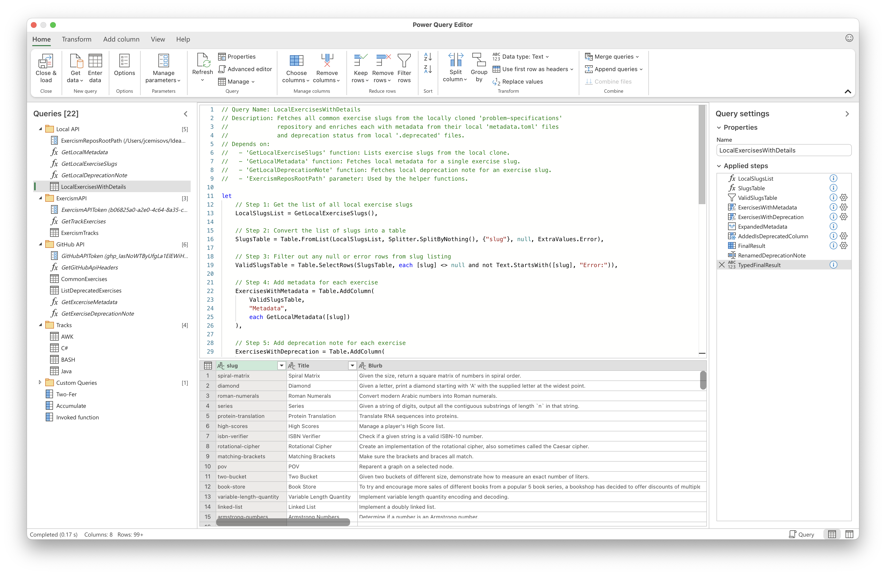
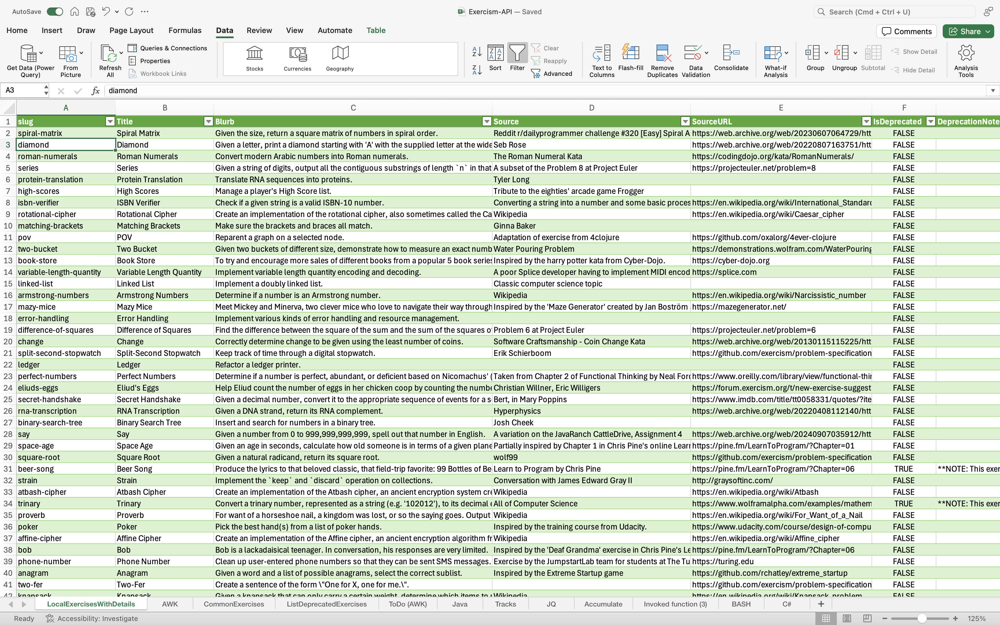

# Local Files API Utilities for Exercism Data

This document describes the Power Query M utilities designed to work with local clones of Exercism repositories, primarily focusing on the `exercism/problem-specifications` repository at present. These utilities allow you to access exercise data directly from your file system, which is useful for offline work, avoiding API rate limits, and working with specific versions of the specifications.

Primarily, these tools are designed to help you get an overview, statistics, and detailed data about exercises directly into **Microsoft Excel**. They should also work seamlessly in **Power BI Desktop** for more advanced data modeling and visualization.

## Overview

The utilities in this section enable you to:
* Define a root path for your local Exercism repository clones.
* List exercise slugs from your local `problem-specifications` clone.
* Fetch and parse `metadata.toml` for each local exercise.
* Check for and retrieve deprecation notes from local `.deprecated` files.
* Combine all this information into a comprehensive table of local exercises with their details, perfect for analysis in Excel or Power BI.

While currently tailored for `problem-specifications`, the `ExercismReposRootPath` parameter is designed to support future extensions for accessing data from locally cloned track repositories (e.g., `awk`, `bash`).

## Prerequisites & Setup

1.  **Local Clones of Exercism Repositories:**
  * You must have a local clone of the `exercism/problem-specifications` repository.
      ```bash
      # Example: Create a root directory for your Exercism clones
      mkdir ~/ExercismClones
      cd ~/ExercismClones
      git clone [https://github.com/exercism/problem-specifications.git](https://github.com/exercism/problem-specifications.git)
      ```
  * In the future, you might clone other track repositories (e.g., `awk`, `bash`) into this same root directory.
  * **Important:** You are responsible for keeping your local clones up-to-date (e.g., by running `git pull` within each repository). These utilities will only see the data present in your local files at the time of execution.

2.  **Configure Root Path Parameter:**
  * Import the `ExercismReposRootPath.pq` file into your Power Query environment.
  * **Rename the imported query to `ExercismReposRootPath`**.
  * Edit this `ExercismReposRootPath` query and replace the placeholder path with the **absolute path** to your root directory where you cloned the Exercism repositories (e.g., `~/ExercismClones` from the example above). See the comments within `ExercismReposRootPath.pq` for detailed instructions.

3.  **Import Utilities:**
  * Import the other `.pq` files from this `local-api` directory into your Power Query environment.
  * **Rename the imported queries** to match the suggested names (e.g., `GetLocalMetadata`, `LocalExercisesWithDetails`) for dependencies to work correctly. This is typically done by right-clicking the query in the Power Query Editor's "Queries" pane and selecting "Rename".

    

## Available Utilities

### 1. `ExercismReposRootPath.pq`

* **Type:** Parameter Query
* **Query Name in Editor:** `ExercismReposRootPath`
* **Description:** Defines the crucial parameter for the root file system path where your Exercism repositories (like `problem-specifications`) are cloned. All other local utilities depend on this parameter being correctly set.
* **Setup:** Requires user to edit the query and set their specific local path.

### 2. `GetLocalExerciseSlugs.pq`

* **Type:** Function
* **Query Name in Editor:** `GetLocalExerciseSlugs`
* **Description:** Lists all exercise slugs (directory names) found within the `exercises` subfolder of your local `problem-specifications` clone.
* **Parameters:** None.
* **Returns:** A list of text values (exercise slugs). Includes basic error handling if the path is inaccessible.
* **Depends on:** `ExercismReposRootPath` parameter.

### 3. `GetLocalMetadata.pq`

* **Type:** Function
* **Query Name in Editor:** `GetLocalMetadata`
* **Description:** Fetches and parses the `metadata.toml` file for a given exercise slug from your local `problem-specifications` clone.
* **Parameter:**
  * `exerciseSlug` (text): The slug of the exercise.
* **Returns:** A record containing `title`, `blurb`, `source`, `source_url`, and `error_message` (if any).
* **Depends on:** `ExercismReposRootPath` parameter.

### 4. `GetLocalDeprecationNote.pq`

* **Type:** Function
* **Query Name in Editor:** `GetLocalDeprecationNote`
* **Description:** Checks for a `.deprecated` file for a given exercise slug in your local `problem-specifications` clone and returns its text content if found.
* **Parameter:**
  * `exerciseSlug` (text): The slug of the exercise.
* **Returns:** Text content of the `.deprecated` file or `null` if not found or an error occurs.
* **Depends on:** `ExercismReposRootPath` parameter.

### 5. `LocalExercisesWithDetails.pq`

* **Type:** Query
* **Query Name in Editor:** `LocalExercisesWithDetails`
* **Description:** This is the main query that combines the functionalities above. It lists all exercises from your local `problem-specifications` clone and enriches them with:
  * Metadata from `metadata.toml`.
  * A boolean flag `IsDeprecated`.
  * The `DeprecationNote` if applicable.
* **Output Columns:** `slug`, `Title`, `Blurb`, `Source`, `SourceURL`, `IsDeprecated`, `DeprecationNote`, `MetadataError`.
* **Depends on:** `GetLocalExerciseSlugs`, `GetLocalMetadata`, `GetLocalDeprecationNote`, and `ExercismReposRootPath`.

## Usage Example

Once all parameters and functions are set up and correctly named in Power Query:

1.  Ensure your `ExercismReposRootPath` parameter points to your local repository root.
2.  Refresh the `LocalExercisesWithDetails` query in Excel (or Power BI).
  * The output will be a table containing all exercises found in your local `problem-specifications/exercises` directory, along with their parsed metadata and deprecation status. This table can then be loaded into an Excel sheet or used in a Power BI data model.

    

This provides a powerful way to analyze and work with Exercism problem specifications entirely from your local machine, primarily for use in Excel or Power BI.
